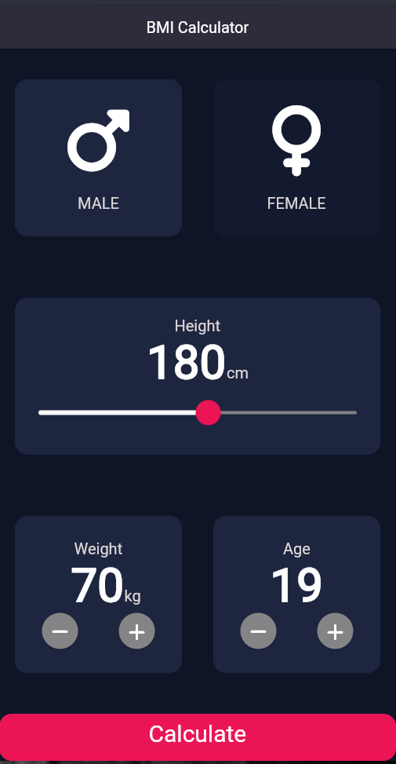
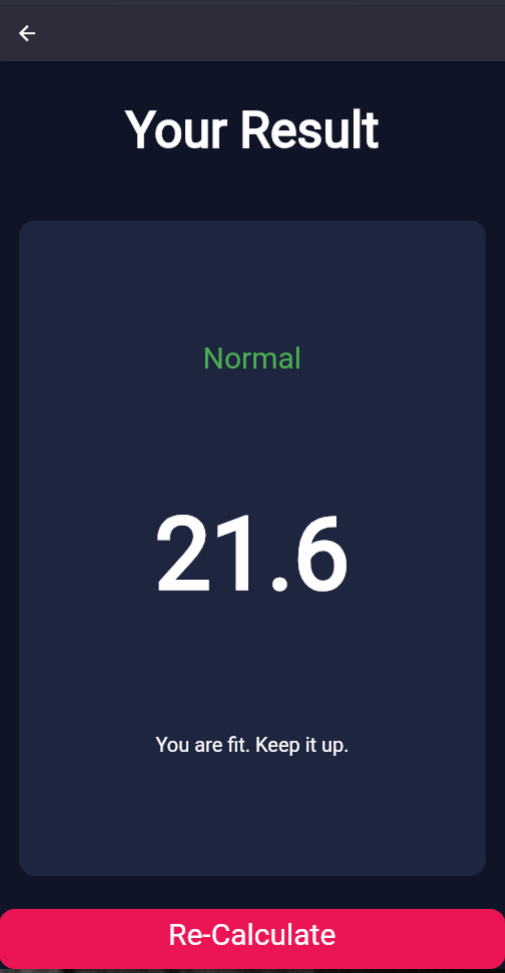

# bmi_calculator

 This is a BMI Calculator designed using flutter. So you can have different output sources of this application like for ANDROID, IOS, LINUX, MAC and WINDOWS.

## Setting Up the Project :
Step 1 : Clone the project or Download the project as Zip.     
Step 2 : Open your VS code or IDE with flutter extension installed and SDK setted previously.   
Step 3 : Open this project.             
Step 4 : Open your terminal and type 'flutter pub get', this gets the dependencies.         
Step 5 : Run the project with the command, 'flutter run'

- [Lab: Write your first Flutter app](https://docs.flutter.dev/get-started/codelab)
  - [Cookbook: Useful Flutter samples](https://docs.flutter.dev/cookbook)           

This are the screenshots of the application ui :

  
  